# 🤖 AI Assistant Platform

> A production-ready AI SaaS platform built with **Django**, **OpenAI**, **Stripe**, and **Discord**.

Create intelligent AI assistants, train them with your own knowledge, deploy them to Discord, and manage everything through a modern web dashboard.

---

## 🌐 Live Demo

### Launch the application

Visit the live application here:

https://ai-assistants-8c06fcfeab86-6fbe77963620.herokuapp.com/

---

## 🚀 Highlights

- 🤖 AI-powered assistants using OpenAI GPT
- 📚 Train assistants with your own knowledge base
- 💬 Real-time AI chat playground
- 🤖 Bring Your Own Discord Bot (BYOB)
- 💳 Premium subscriptions with Stripe Checkout
- 👤 Secure authentication and authorization
- 📊 Dashboard with analytics and usage tracking
- 📦 REST API integration
- 🌙 Dark and Light mode
- 📱 Fully responsive design
- ☁️ Cloud deployment on Heroku

---

## 📸 Preview

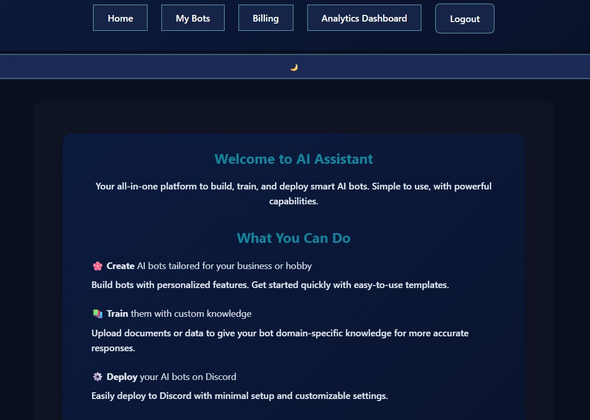

---

# ✨ Features

AI Assistant Platform combines artificial intelligence, knowledge management, subscription management, and Discord integration into a single production-ready web application.

---

## 🤖 AI Assistants

Create and manage intelligent AI assistants powered by OpenAI.

### Capabilities

- Create custom AI assistants
- Configure assistant personalities and behaviour
- Organize assistants by category
- Real-time AI conversations
- Context-aware responses
- Conversation history
- Daily usage tracking
- Premium users can create unlimited assistants

---

## 📚 Knowledge Base

Improve assistant accuracy by training it with your own documents.

### Included Functionality

- Upload TXT knowledge files
- Automatic text processing
- Intelligent text chunking
- Embedding generation
- Semantic search
- AI responses based on uploaded knowledge
- Easy knowledge management

---

## 💬 AI Playground

Test every assistant before deploying it.

### Functionality

- Real-time AJAX chat
- Instant AI responses
- Conversation history
- Fast asynchronous communication
- Mobile-friendly interface
- Dark and Light mode support

---

## 🤖 Discord Integration

Deploy assistants directly to your own Discord server using the included Bring Your Own Bot (BYOB) solution.

### Included Features

- Bring Your Own Discord Bot
- Downloadable Discord Bridge package
- Setup Guide included
- Commands Guide included
- Discord Invite Generator
- Secure API communication
- Windows support
- macOS support
- Linux support

---

## 💳 Premium Membership

Unlock advanced platform functionality through Stripe Checkout.

### Features

- Secure Stripe Checkout
- Premium subscriptions
- Unlimited AI assistants
- Premium-only functionality
- Secure payment processing

---

## 📊 Dashboard & Analytics

Monitor platform activity from a centralized dashboard.

### Analytics

- User dashboard
- Assistant overview
- Usage statistics
- Token usage tracking
- Conversation logs
- CSV export
- Staff-only analytics

---

## 👤 User Management

Secure authentication powered by Django.

### Features

- User registration
- Login and logout
- Password reset
- Email notifications
- Secure sessions
- Protected routes
- User profiles

---

## 🔌 APIs & Integrations

The platform integrates with several external services.

### Integrations

- OpenAI API
- Stripe API
- Discord API
- Django REST Framework
- Secure API token authentication

---

## 🎨 User Experience

Designed to provide a modern experience across all devices.

### Features

- Fully responsive layout
- Dark and Light mode
- Modern user interface
- Responsive navigation
- Accessible forms
- Custom success messages
- Custom error messages

---

## 🔒 Security

Security has been considered throughout the application.

### Features

- CSRF protection
- Authentication and authorization
- Ownership validation
- Protected API endpoints
- Environment variables
- HTTPS-ready deployment
- Secure session handling

---

# 📸 Application Tour

The following screenshots provide an overview of the application's interface and demonstrate the main features available throughout the platform.

---

## 🏠 Home Page

The landing page introduces the platform, highlights its core features, and provides quick access to user authentication and the dashboard.


---

## ☀️ Light Theme

Users can switch between Dark and Light mode at any time. The selected preference is automatically remembered for future visits.

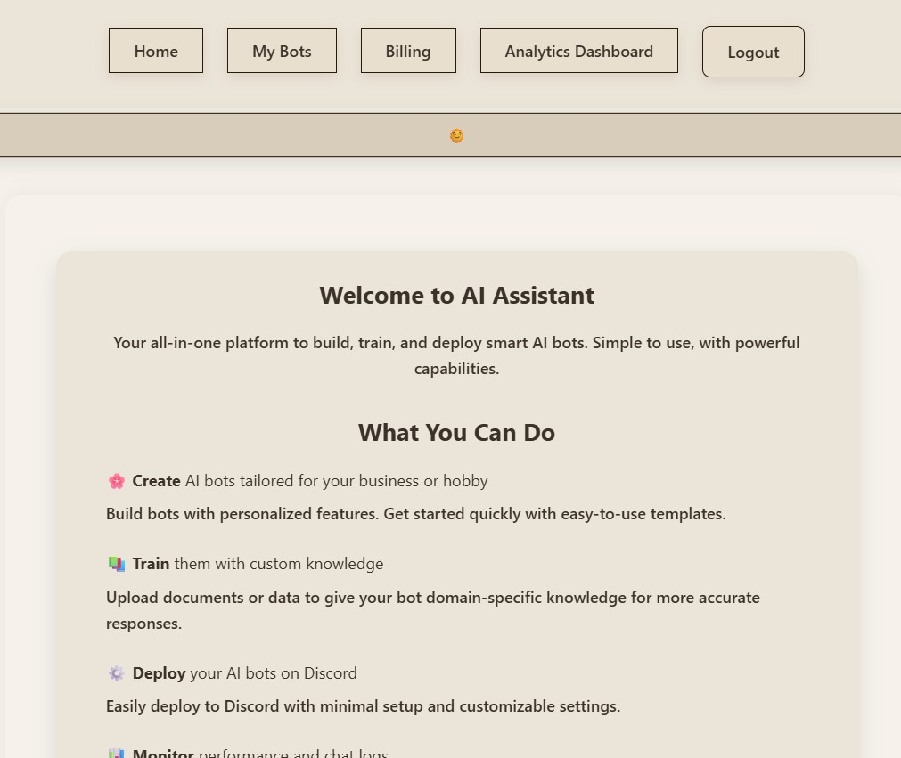

---

## 🤖 Create an AI Assistant

Create fully customized AI assistants by defining their name, category, personality, and behavior.

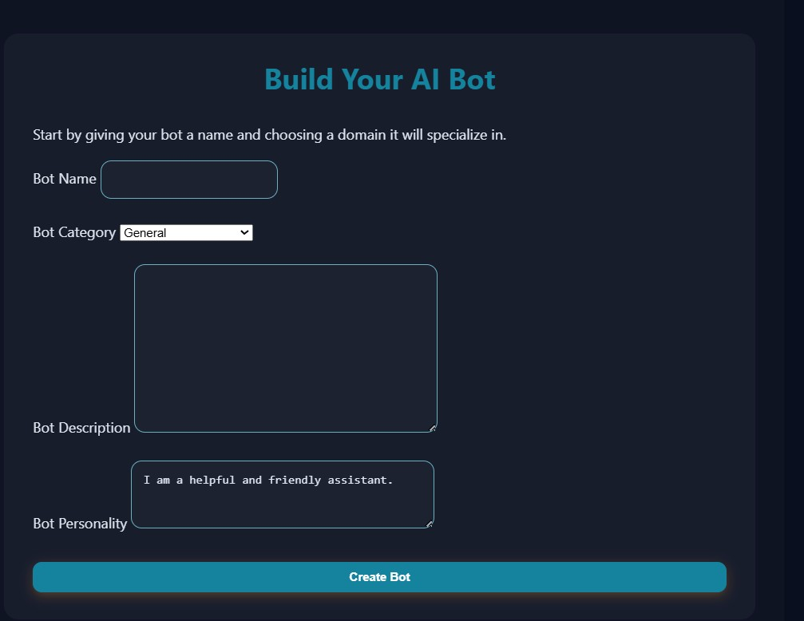

---

## 💬 AI Playground

Each assistant includes its own interactive chat playground where conversations take place in real time using OpenAI.

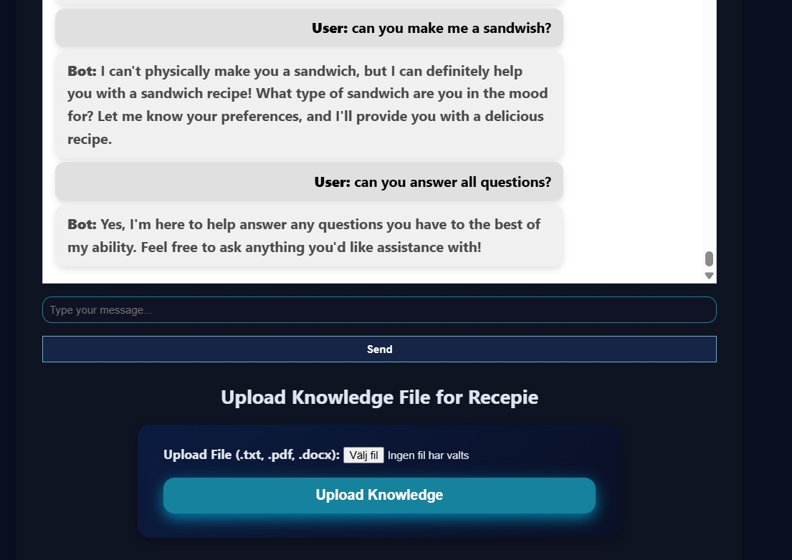

---

## 📚 Knowledge Base

Upload your own text files to provide assistants with additional knowledge. Uploaded documents are processed and made available for semantic retrieval.

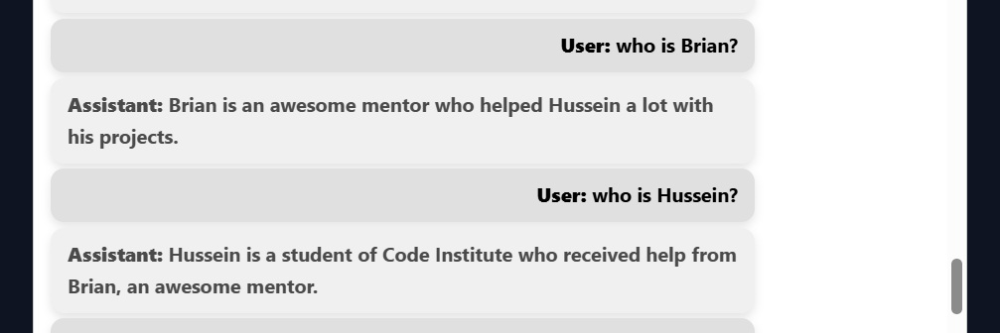

---

## ✅ Knowledge Processing Complete

Once processing is complete, the uploaded knowledge becomes immediately available for AI-generated responses.


---

## 🤖 Discord Integration

Deploy assistants directly to your own Discord server using the included Bring Your Own Bot (BYOB) bridge.

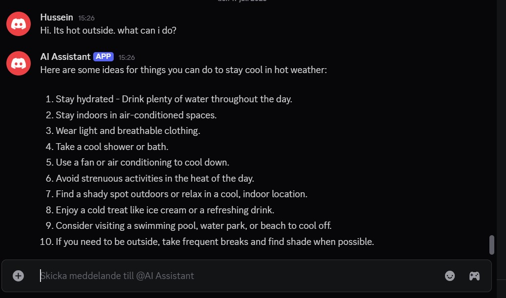

---

## 💳 Premium Membership

Upgrade to a Premium account to unlock unlimited AI assistants and additional platform features.


---

## 💳 Secure Stripe Checkout

Premium subscriptions are processed securely through Stripe Checkout.

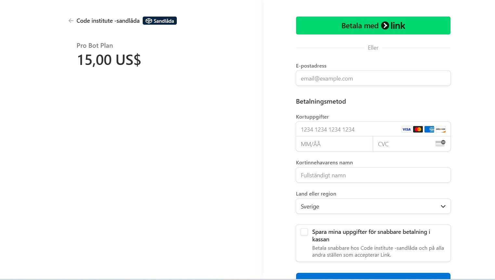

---

## ✅ Successful Payment

Example of a completed payment using Stripe's official test environment.

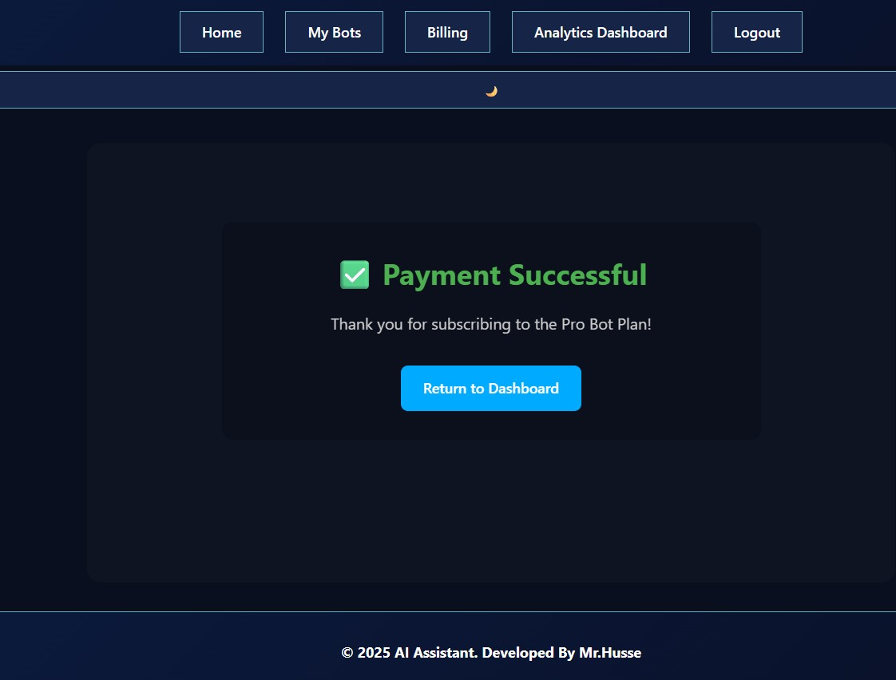

---

## 📧 User Registration

New users can create an account using the integrated registration system.

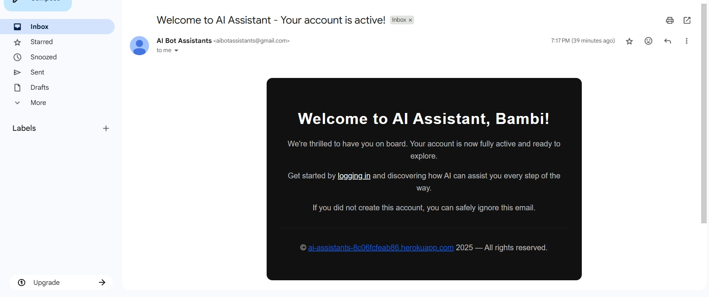

---

## 🔐 Password Recovery

Forgotten passwords can be securely reset through the email-based recovery process.

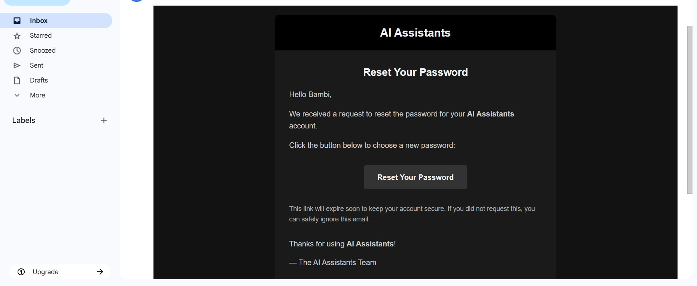

---

## 📨 Email Notifications

Important account events automatically generate email notifications for the user.


---

## ⚠️ Form Validation

Built-in validation provides clear and user-friendly feedback whenever incorrect or incomplete information is submitted.

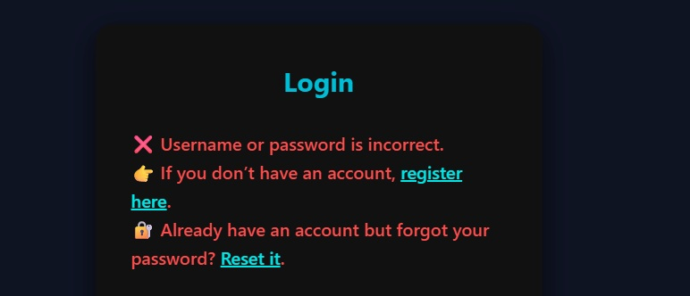

---

# 🔄 System Workflows

The following diagrams illustrate the internal architecture of the AI Assistant Platform, showing how data flows through the application and how the different components interact.

---

## 🔁 CRUD Workflow

This diagram illustrates the complete lifecycle of an AI assistant, from creation and management to updating and deletion. It demonstrates how users interact with the application through Django views and how data is stored using the Django ORM.

**Workflow**

- User creates an AI assistant
- Data is validated
- Bot information is stored in the database
- Users can view, edit or delete existing assistants
- Changes are immediately reflected throughout the application

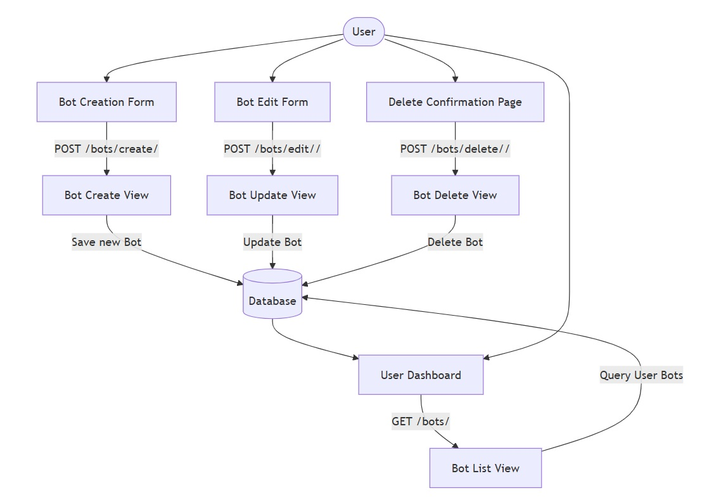

---

## 💬 AJAX Chat Flow

The AI Playground uses asynchronous AJAX requests to provide real-time conversations without requiring page reloads.

Each user message is processed by Django before being forwarded to the OpenAI API. The generated response is then returned to the browser and displayed instantly.

**Workflow**

1. User submits a message
2. JavaScript sends an AJAX request
3. Django validates the request
4. OpenAI generates a response
5. The response is returned to Django
6. JavaScript updates the conversation without refreshing the page

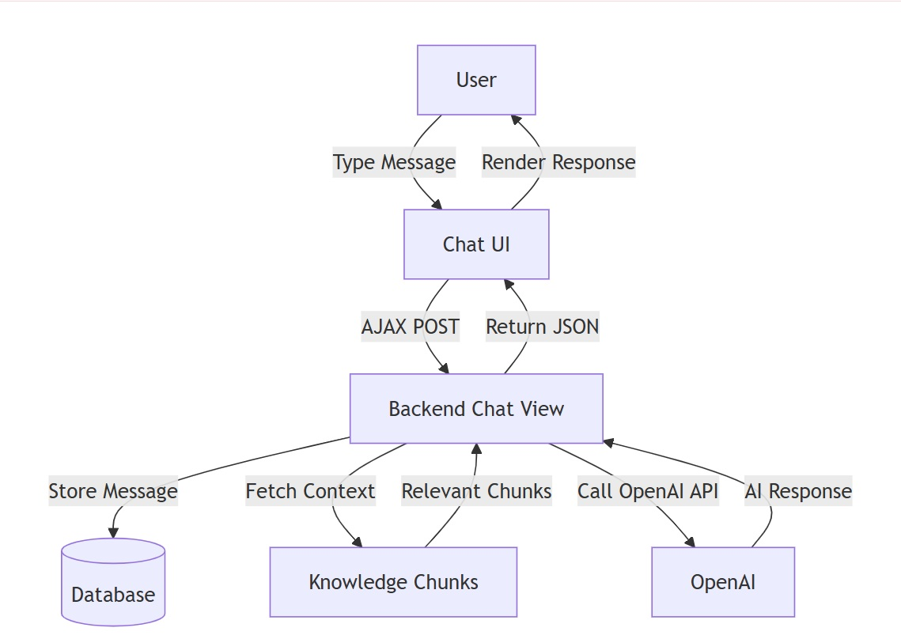

---

## 📚 Knowledge Base Processing

Uploaded knowledge files are automatically processed before becoming available to AI assistants.

The processing pipeline converts raw text into searchable knowledge chunks, enabling semantic retrieval and more accurate AI responses.

**Workflow**

1. User uploads a TXT file
2. The file is processed
3. Text is divided into smaller chunks
4. Embeddings are generated
5. Knowledge is stored in PostgreSQL
6. Relevant information is retrieved during AI conversations

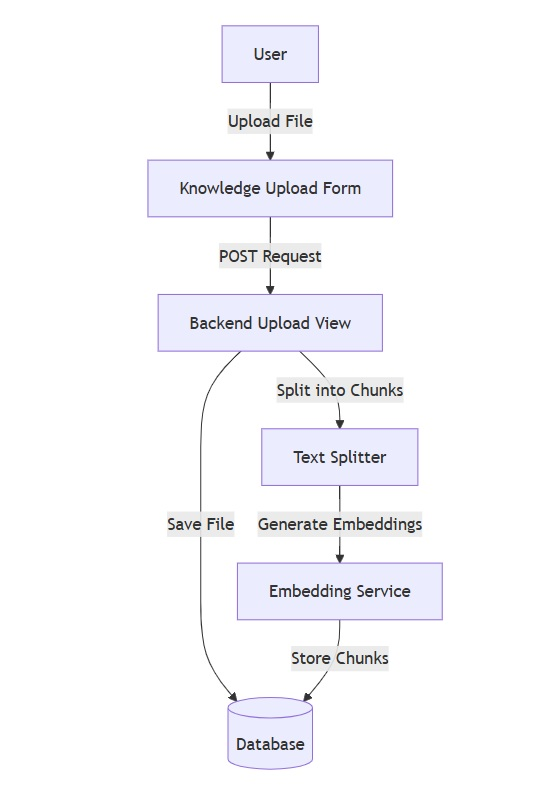

---

## 🗄️ Database Entity Relationship Diagram (ERD)

The Entity Relationship Diagram illustrates how the application's database models are connected.

The platform is built using Django ORM with PostgreSQL in production, allowing relationships between users, AI assistants, conversations, uploaded knowledge, and subscription data.

### Main Relationships

- Users own multiple AI assistants
- AI assistants contain conversation history
- AI assistants can have multiple knowledge files
- Knowledge files are divided into searchable chunks
- AI assistants generate usage statistics
- Users have subscription information and premium status

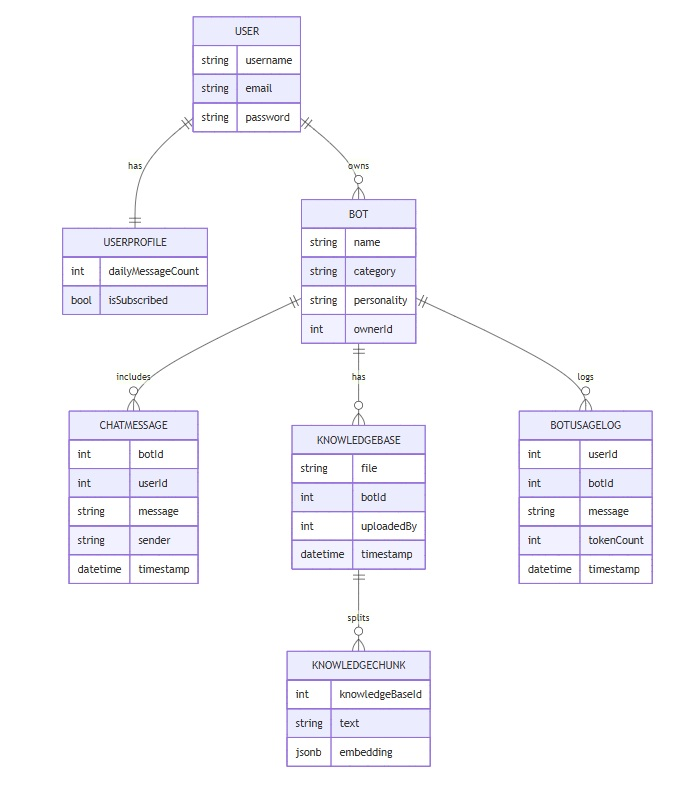

---

# ✅ Validation

The AI Assistant Platform has been tested throughout development to ensure code quality, accessibility, responsiveness, and compliance with modern web standards.

The following validation tools were used during development.

---

## 🌐 HTML Validation

HTML pages were validated using the official W3C HTML Validator to ensure semantic structure and standards compliance.

### Validation Goals

- Semantic HTML5
- No critical validation errors
- Accessible document structure
- Standards-compliant markup

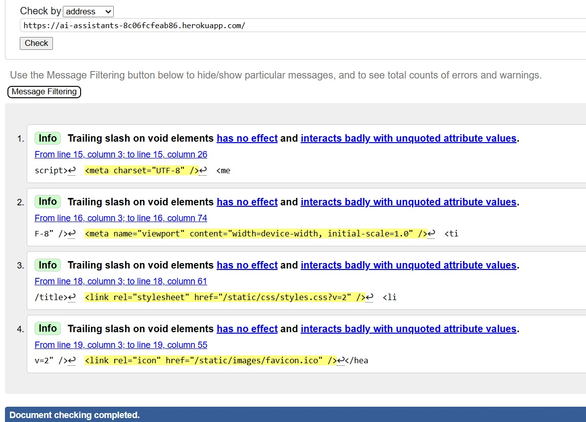

---

## 🎨 CSS Validation

Stylesheets were validated using the W3C CSS Validator to verify syntax correctness and CSS standards compliance.

### Validation Goals

- Valid CSS3
- No critical errors
- Consistent styling
- Cross-browser compatibility

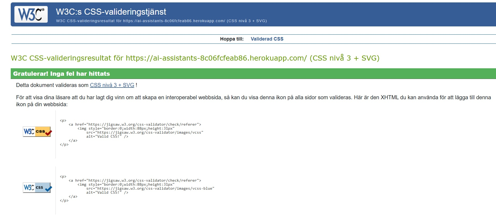

---

## 🚀 Lighthouse Audit

Google Lighthouse was used to evaluate the application's overall quality and user experience.

The audit focuses on several important areas of modern web development.

### Areas Tested

- Performance
- Accessibility
- Best Practices
- Search Engine Optimization (SEO)

The application achieved high Lighthouse scores while maintaining responsive layouts and a modern user experience.

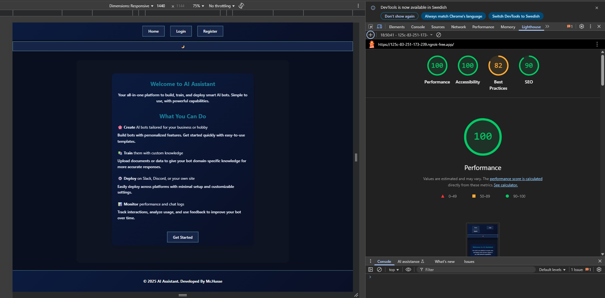

---

## 📱 Responsive Testing

The user interface was tested across multiple screen sizes to ensure a consistent experience on different devices.

### Devices Tested

- Desktop
- Laptop
- Tablet
- Mobile

The responsive layout adapts automatically using CSS media queries and flexible layouts.

---

## 🔒 Functional Testing

The platform was manually tested throughout development to verify that all major features operate correctly.

### Features Tested

- User registration
- Login and logout
- Password reset
- AI assistant creation
- Bot editing and deletion
- AI Playground conversations
- Knowledge Base uploads
- Discord integration
- Stripe Checkout
- Premium account restrictions
- Dashboard functionality
- Responsive navigation

---

## ✅ Validation Summary

The project was successfully validated using industry-standard tools and manual testing to ensure reliability, accessibility, responsiveness, and production readiness.

---

# 🛠️ Technology Stack

The AI Assistant Platform is built using modern technologies for web development, artificial intelligence, cloud deployment, payment processing, and database management.

---

## 🖥️ Backend

| Technology | Purpose |
|------------|---------|
| Python 3.13 | Core programming language |
| Django 5.2 | Web framework |
| Django REST Framework | REST API development |
| Gunicorn | Production WSGI server |
| WhiteNoise | Static file serving |
| PostgreSQL | Production database |
| SQLite | Local development database |

---

## 🎨 Frontend

| Technology | Purpose |
|------------|---------|
| HTML5 | Application structure |
| CSS3 | Styling and responsive layouts |
| JavaScript (ES6) | Client-side functionality |
| AJAX | Real-time asynchronous communication |

---

## 🤖 Artificial Intelligence

| Technology | Purpose |
|------------|---------|
| OpenAI GPT | AI-generated conversations |
| OpenAI Embeddings | Semantic knowledge retrieval |
| Knowledge Chunking | Document processing |
| Prompt Engineering | Assistant behaviour and context management |

---

## 💳 Payment Processing

| Technology | Purpose |
|------------|---------|
| Stripe Checkout | Secure payment processing |
| Stripe API | Subscription management |
| Stripe Webhooks | Payment event handling |

---

## 🤖 Discord Integration

| Technology | Purpose |
|------------|---------|
| discord.py | Discord bot communication |
| Discord Developer Portal | Bot management |
| Bring Your Own Bot (BYOB) | User-owned Discord bots |

---

## 🗄️ Database

| Technology | Purpose |
|------------|---------|
| PostgreSQL | Production database |
| SQLite | Local development |
| Django ORM | Database abstraction layer |

---

## ☁️ Cloud & Deployment

| Technology | Purpose |
|------------|---------|
| Heroku | Cloud hosting platform |
| PostgreSQL Add-on | Managed production database |
| Git | Version control |
| GitHub | Source code hosting |

---

## 🧪 Development Tools

| Tool | Purpose |
|------|---------|
| Visual Studio Code | Development environment |
| GitHub Desktop | Git management |
| Heroku CLI | Deployment |
| Postman | API testing |
| Black | Python code formatting |
| Flake8 | Python linting |
| W3C HTML Validator | HTML validation |
| W3C CSS Validator | CSS validation |
| Lighthouse | Performance and accessibility auditing |

---

# 📦 Python Packages

The AI Assistant Platform relies on a number of carefully selected Python packages that provide the core functionality for web development, artificial intelligence, database connectivity, payment processing, and deployment.

| Package | Purpose |
|---------|---------|
| Django | Core web framework |
| Django REST Framework | REST API development |
| OpenAI | AI conversations and embeddings |
| Stripe | Payment processing and subscriptions |
| psycopg | PostgreSQL database adapter |
| Gunicorn | Production WSGI server |
| WhiteNoise | Static file serving |
| discord.py | Discord bot communication |
| Pillow | Image processing |
| python-dotenv | Environment variable management |

### Why These Packages?

These libraries were selected because they are widely adopted, well documented, and production-ready.

Together they provide:

- Secure authentication and session management
- AI-powered conversations using OpenAI
- Knowledge Base processing with embeddings
- Secure Stripe payment integration
- PostgreSQL database connectivity
- Discord bot communication
- REST API development
- Reliable production deployment on Heroku

Additional development and dependency packages can be found in the project's `requirements.txt` file.

---

## 🔗 External Services

The application integrates with several third-party services to provide AI functionality, payment processing, cloud hosting, and Discord deployment.

- OpenAI API
- Stripe API
- Discord API
- Heroku
- PostgreSQL

---

# 📂 Project Structure

The project is organized using Django's multi-app architecture. Each application is responsible for a specific area of functionality, making the codebase modular, maintainable, and easy to extend.

```text
ai-assistant/
│
├── accounts/                  # Authentication and user management
│   ├── migrations/
│   ├── templates/
│   ├── forms.py
│   ├── models.py
│   ├── urls.py
│   └── views.py
│
├── bots/                      # AI assistants, chat and knowledge base
│   ├── migrations/
│   ├── templates/
│   ├── static/
│   ├── models.py
│   ├── urls.py
│   ├── views.py
│   ├── utils.py
│   └── services.py
│
├── dashboard/                 # Dashboard and analytics
│   ├── templates/
│   ├── urls.py
│   └── views.py
│
├── payments/                  # Stripe integration
│   ├── templates/
│   ├── urls.py
│   ├── views.py
│   └── webhooks.py
│
├── buildabot/                 # Django project configuration
│   ├── settings.py
│   ├── urls.py
│   ├── asgi.py
│   └── wsgi.py
│
├── static/                    # Global static files
│   ├── css/
│   ├── js/
│   ├── images/
│   └── discord_bridge/
│
├── media/                     # Uploaded user files
│
├── templates/                 # Shared templates
│
├── readme-img-validation/     # README screenshots
│
├── requirements.txt
├── manage.py
├── Procfile
├── runtime.txt
├── .gitignore
├── .python-version
└── README.md
```

---

## 📦 Application Overview

### 👤 Accounts

Handles user authentication and account management.

**Responsibilities**

- User registration
- Login and logout
- Password reset
- Email notifications
- User profiles
- Authentication

---

### 🤖 Bots

Contains the core functionality of the platform.

**Responsibilities**

- AI assistant management
- Chat Playground
- Knowledge Base
- OpenAI integration
- Discord integration
- REST API endpoints

---

### 📊 Dashboard

Provides an overview of user activity.

**Responsibilities**

- Dashboard
- Analytics
- Usage statistics
- Conversation history
- CSV exports

---

### 💳 Payments

Handles premium subscriptions and billing.

**Responsibilities**

- Stripe Checkout
- Premium subscriptions
- Payment verification
- Subscription management

---

### ⚙️ Buildabot

Contains the Django project configuration.

**Responsibilities**

- Project settings
- URL routing
- WSGI configuration
- ASGI configuration

---

## 🎯 Why This Structure?

The project follows a modular architecture where every Django application has a single responsibility.

This approach provides several advantages:

- Better code organization
- Easier maintenance
- Improved scalability
- Simpler testing
- Reusable components
- Clear separation of concerns

---

# 🏗️ Architecture

The AI Assistant Platform follows Django's **Model–View–Template (MVT)** architecture and is organized into multiple independent applications.

Each application has a clearly defined responsibility, making the platform modular, scalable, and easier to maintain as new features are added.

---

## 🧩 High-Level Architecture

```text
                        Browser
                           │
                           ▼
                    Django URL Router
                           │
        ┌──────────────────┼──────────────────┐
        ▼                  ▼                  ▼
   Accounts App        Bots App        Payments App
        │                  │                  │
        ▼                  ▼                  ▼
 Authentication       OpenAI API         Stripe API
        │                  │                  │
        └──────────────┬───┴──────────────────┘
                       ▼
               PostgreSQL Database
                       ▲
                       │
          Knowledge Base & Analytics
                       │
                       ▼
               Discord Bridge API
```

---

## 🧱 Application Architecture

The project is divided into multiple Django applications, each responsible for a specific area of the platform.

### 👤 Accounts

Manages authentication and user accounts.

**Responsibilities**

- User registration
- Login and logout
- Password reset
- User profiles
- Email notifications
- Session management

---

### 🤖 Bots

The core application responsible for AI functionality.

**Responsibilities**

- AI assistant CRUD
- OpenAI integration
- AI Playground
- Knowledge Base
- Discord integration
- API endpoints
- Usage tracking

---

### 💳 Payments

Handles subscription management and premium functionality.

**Responsibilities**

- Stripe Checkout
- Premium subscriptions
- Subscription validation
- Payment success and cancellation
- Feature restrictions

---

### 📊 Dashboard

Provides insights into user activity.

**Responsibilities**

- Dashboard overview
- AI assistant management
- Usage statistics
- Conversation analytics
- CSV exports

---

## 🗄️ Database Design

The application uses **PostgreSQL** in production together with Django ORM.

The database is designed around relationships between users, assistants, conversations, uploaded knowledge, and subscription information.

### Core Relationships

- One user can own multiple AI assistants.
- Each AI assistant stores its own conversation history.
- Each assistant can have multiple uploaded knowledge files.
- Knowledge files are processed into searchable chunks.
- Usage logs are linked to individual assistants.
- Premium status is associated with each user account.

---

## 🔄 Request Lifecycle

The following illustrates a typical request within the platform.

```text
User
 │
 ▼
Browser
 │
 ▼
Django URL Router
 │
 ▼
View
 │
 ▼
Business Logic
 │
 ├───────────────┐
 ▼               ▼
Database     External APIs
 │               │
 │         ├── OpenAI
 │         ├── Stripe
 │         └── Discord
 │
 └───────────────┐
                 ▼
          HTTP Response
                 │
                 ▼
              Browser
```

---

## 🔌 External Services

Several third-party services extend the platform's functionality.

| Service | Purpose |
|---------|---------|
| OpenAI API | AI-generated conversations |
| Stripe API | Payment processing |
| Discord API | Discord bot integration |
| PostgreSQL | Production database |
| Heroku | Cloud hosting |

---

## 🎯 Architectural Principles

The application was designed around a number of core software engineering principles.

### Separation of Concerns

Each Django application is responsible for one area of functionality, keeping the codebase organized and maintainable.

### Modularity

Independent applications make it easier to extend or replace functionality without affecting the rest of the project.

### Scalability

The architecture supports future expansion, including additional AI models, new integrations, and enterprise features.

### Security

Authentication, authorization, CSRF protection, secure API communication, and environment variables are integrated throughout the application.

### Maintainability

Reusable components, clear project organization, and Django's MVT architecture simplify future development and long-term maintenance.

---

# 🛣️ Roadmap

The AI Assistant Platform is actively being improved. Below are some of the planned features and future enhancements.

## Completed ✅

- User authentication
- AI chat powered by OpenAI
- Knowledge Base uploads
- Discord Bridge
- Discord Invite Generator
- Stripe Checkout
- Premium accounts
- REST API
- Admin analytics
- CSV exports
- Dark / Light theme
- Mobile responsive interface

---

## In Progress 🚧

- Monthly subscription billing
- Stripe webhooks for automatic subscription updates
- Improved analytics dashboard
- Better token usage reporting

---

## Planned 📌

- AI image generation
- Voice conversations
- Speech-to-text
- Text-to-speech
- AI document analysis
- Multiple AI models
- Team workspaces
- Shared assistants
- Public assistant marketplace
- Docker deployment
- Kubernetes deployment
- API documentation
- Multi-language interface
- Two-factor authentication (2FA)
- OAuth login (Google, GitHub, Discord)
- Usage notifications
- Billing dashboard
- Custom domains
- Assistant version history

---

## Long-Term Vision 🚀

The long-term goal is to turn AI Assistant Platform into a complete ecosystem where individuals and businesses can create, train, deploy and manage intelligent AI assistants across multiple platforms including Discord, websites and external applications.

---

# ⭐ Why This Project?

Most AI assistant projects focus only on basic chatbot functionality. This project was designed to provide a complete AI platform where users can create, customize, train, and deploy their own assistants with minimal setup.

Instead of being limited to a simple chat interface, the platform combines multiple modern technologies into one integrated ecosystem.

## What makes this project different?

- 🤖 AI assistants powered by OpenAI
- 📚 Knowledge Base uploads for custom responses
- 💬 Real-time conversations
- 🎮 Discord deployment using a Bring Your Own Bot (BYOB) approach
- 💳 Premium subscriptions with Stripe Checkout
- 📊 Usage analytics and logging
- 🔐 Secure authentication and authorization
- 🌙 Dark and Light themes
- 📱 Fully responsive interface
- ⚡ Modern Django architecture with multiple reusable apps

## Main Goals

The project was created to demonstrate professional full-stack development using Django while solving a real-world problem.

Key goals include:

- Building scalable Django applications
- Integrating multiple third-party APIs
- Designing secure authentication systems
- Implementing subscription-based features
- Managing AI conversations and knowledge retrieval
- Providing an intuitive user experience
- Creating a production-ready deployment

## Target Users

The platform is designed for:

- Developers
- Small businesses
- Discord communities
- AI enthusiasts
- Content creators
- Anyone who wants to build and deploy custom AI assistants without creating everything from scratch.

---

# ⚡ Challenges & Lessons Learned

Building the AI Assistant Platform involved solving a number of real-world engineering challenges beyond simply writing application code.

## Major Challenges

### OpenAI Integration

One of the biggest challenges was designing prompts that produced reliable responses while allowing each assistant to maintain its own personality and knowledge.

---

### Knowledge Base Processing

Uploaded documents needed to be:

- processed safely
- split into meaningful chunks
- stored efficiently
- retrieved quickly
- injected into AI prompts

Designing this workflow required balancing response quality with token usage.

---

### Discord Integration

Instead of creating a shared Discord bot, I chose a Bring Your Own Bot (BYOB) approach.

This required building a secure bridge between:

- Discord
- Django
- OpenAI

while keeping user API tokens protected.

---

### Stripe Integration

Implementing secure payments involved:

- Checkout Sessions
- Premium access validation
- Subscription restrictions
- Secure environment variables
- Production configuration

---

### Deployment

Deploying the project required solving several production issues including:

- Static file handling
- PostgreSQL configuration
- Environment variables
- HTTPS configuration
- Debug vs Production settings

---

## Lessons Learned

Working on this project significantly improved my understanding of:

- Django architecture
- REST APIs
- Authentication & authorization
- Secure deployment
- PostgreSQL
- Stripe payments
- AI prompt engineering
- External API integrations
- Production debugging
- Large-scale project organization

---

## Biggest Takeaway

The biggest lesson from this project was that building production-ready software is about much more than writing code.

Planning, debugging, deployment, security, scalability, user experience, and maintainability are equally important parts of delivering a complete application.

---

# 💡 Design Decisions

Throughout development, several architectural and technical decisions were made to keep the platform scalable, secure, and easy to maintain.

---

## Django MVT

The project follows Django's Model–View–Template (MVT) architecture.

This separates responsibilities between:

- Models
- Views
- Templates
- Business logic

Using Django's MVT pattern keeps the application organized, maintainable, and easier to extend as new functionality is added.

---

## Multi-App Architecture

Instead of placing the entire application inside a single Django app, the project is divided into multiple independent applications.

Current applications include:

- Accounts
- Bots
- Dashboard
- Payments

This architecture provides several advantages:

- Better code organization
- Clear separation of responsibilities
- Easier maintenance
- Simpler testing
- Improved scalability
- Reusable components

---

## PostgreSQL

SQLite is used during local development, while PostgreSQL is used in production.

This approach provides:

- Better scalability
- Improved performance
- Production-grade reliability
- Strong relational data support
- Excellent compatibility with Django ORM

---

## AJAX Chat

The AI Playground uses asynchronous AJAX requests instead of traditional page reloads.

Benefits include:

- Faster conversations
- Instant AI responses
- Improved user experience
- Reduced bandwidth usage
- More responsive interface

---

## Knowledge Base

Uploaded knowledge files are processed before being used during AI conversations.

Each document is:

- Uploaded
- Parsed
- Split into semantic chunks
- Converted into embeddings
- Stored in the database
- Retrieved when relevant

This approach improves response quality while reducing unnecessary token usage.

---

## Bring Your Own Bot (BYOB)

Instead of hosting a shared Discord bot, users connect their own Discord application.

Advantages include:

- Full ownership
- Better privacy
- No shared rate limits
- Easier customization
- Better scalability
- Greater flexibility for server administrators

---

## Stripe Checkout

Stripe Checkout was selected because it provides a secure and production-ready payment solution.

Benefits include:

- Secure payment processing
- PCI compliance
- Reliable subscription handling
- Excellent documentation
- Simple integration with Django

---

## Environment Variables

Sensitive information is never stored inside the repository.

Configuration values such as API keys, database credentials, and secret keys are managed using environment variables.

Examples include:

- Django Secret Key
- OpenAI API Key
- Stripe Keys
- Database URL
- Email Credentials

This improves both security and deployment flexibility.

---

## Responsive Design

The interface follows a responsive, mobile-first design philosophy.

The application has been optimized for:

- Desktop
- Laptop
- Tablet
- Mobile devices

Flexible layouts and CSS media queries ensure a consistent experience across different screen sizes.

---

## Focus on Maintainability

Long-term maintainability was a priority throughout development.

Key principles include:

- Readable code
- Modular architecture
- Clear folder structure
- Reusable components
- Consistent coding standards
- Separation of concerns
- Scalable project organization

These decisions make the project easier to understand, maintain, and extend in the future.

---

# 🚀 Installation

Follow the steps below to set up and run the AI Assistant Platform locally.

---

## 📋 Prerequisites

Before getting started, ensure that you have the following installed:

- Python 3.13 or newer
- Git
- PostgreSQL (recommended for production)
- SQLite (used by default for local development)
- A Stripe account (for payment testing)
- An OpenAI API key
- A Discord Developer account (optional, for Discord integration)

---

## 📥 Clone the Repository

Clone the project from GitHub.

```bash
git clone https://github.com/God-zil-la/ai-assistant.git
```

Navigate into the project directory.

```bash
cd ai-assistant
```

---

## 🐍 Create a Virtual Environment

Create a virtual environment.

### Windows

```bash
python -m venv .venv
```

Activate it.

```bash
.venv\Scripts\activate
```

### macOS / Linux

```bash
python3 -m venv .venv
source .venv/bin/activate
```

---

## 📦 Install Dependencies

Install all required Python packages.

```bash
pip install -r requirements.txt
```

---

## ⚙️ Configure Environment Variables

Create a `.env` file in the project root.

Example:

```env
SECRET_KEY=your-secret-key

DEBUG=True

OPENAI_API_KEY=your-openai-key

DATABASE_URL=your-database-url

STRIPE_PUBLIC_KEY=pk_test_xxxxxxxxx

STRIPE_SECRET_KEY=sk_test_xxxxxxxxx

STRIPE_WEBHOOK_SECRET=whsec_xxxxxxxxx

EMAIL_HOST_USER=your-email

EMAIL_HOST_PASSWORD=your-email-password
```

Discord integration is optional.

If you plan to deploy assistants to Discord, configure your Discord application credentials as described in the included Discord Setup Guide.

---

## 🗄️ Apply Database Migrations

Create the database schema.

```bash
python manage.py migrate
```

---

## 👤 Create an Administrator Account

Create a Django superuser.

```bash
python manage.py createsuperuser
```

Follow the prompts to create your administrator account.

---

## 📁 Collect Static Files

For production deployments, collect static assets.

```bash
python manage.py collectstatic
```

---

## ▶️ Run the Development Server

Start the Django development server.

```bash
python manage.py runserver
```

The application will now be available at:

```
http://127.0.0.1:8000/
```

---

## 🔑 Configure OpenAI

Generate an API key from the OpenAI dashboard and add it to your `.env` file.

```env
OPENAI_API_KEY=your-openai-api-key
```

Without a valid API key, AI conversations will not function.

---

## 💳 Stripe Test Mode

To test premium subscriptions:

- Create a Stripe account
- Enable Test Mode
- Generate API keys
- Configure the Stripe webhook endpoint
- Add the keys to your `.env`

The application uses Stripe Checkout for secure payment processing.

---

## 🤖 Discord Integration (Optional)

To deploy assistants to Discord:

1. Create a Discord Application.
2. Create a Bot.
3. Enable the required Gateway Intents.
4. Download the included Discord Bridge package.
5. Follow the provided Setup Guide.
6. Invite your bot to your server.
7. Start the bridge application.

Once configured, your AI assistant can communicate directly inside your own Discord server.

---

## ✅ Verify the Installation

After starting the application, verify that everything works correctly.

You should be able to:

- Register a new account
- Log in
- Create an AI assistant
- Start conversations
- Upload a knowledge file
- Access the dashboard
- Upgrade using Stripe Test Mode
- Deploy assistants to Discord (optional)

If all of the above work successfully, the installation has been completed correctly.

---

You are now ready to create AI assistants, upload knowledge, integrate Discord bots, and explore the platform's full functionality.

---

# 📄 License

This project is licensed under the MIT License.

You are free to use, modify, and distribute this software in accordance with the terms of the license.

See the LICENSE file for more information.

---

# 🙏 Acknowledgements

This project would not have been possible without the excellent open-source tools and services provided by the following communities and organizations.

Special thanks to:

- Django
- OpenAI
- Stripe
- Discord
- Heroku
- PostgreSQL
- Django REST Framework
- Code Institute
- GitHub

Their documentation, tools, and communities played an important role throughout the development of this project.

---

# 👨‍💻 Author

**Hussein Elali**

Full Stack Web Developer

- GitHub: https://github.com/God-zil-la
- Portfolio: https://god-zil-la.github.io/portfolio/
- LinkedIn: https://www.linkedin.com/in/hussein-elali/

---

# ⭐ Support

If you found this project useful, consider giving it a ⭐ on GitHub.

Feedback, suggestions, and contributions are always welcome.

---

## Thank you for visiting AI Assistant Platform!
