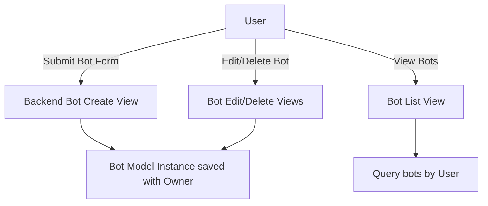

# 🤖 AI Assistant Platform

Live Demo: [https://ai-assistant.herokuapp.com](https://ai-assistants-8c06fcfeab86.herokuapp.com/)

---

## 🧭 Table of Contents
- [📘 Overview](#overview)
- [🧑‍💻 Features](#features)
- [📋 User Stories](#user-stories)
- [🔐 User Authentication](#user-authentication)
- [🤖 Bot Management](#bot-management)
- [🤖 Discord Connection](#discord-connection)
- [💬 Test Playground](#test-playground)
- [💳 Stripe Payment Integration](#stripe-payment-integration)
- [🧠 AI Chat Integration](#ai-chat-integration)
- [📊 Monitor Logs & Analytics](#monitor-logs--analytics)
- [🎨 Styling and UX](#styling-and-ux)
- [🔄 CRUD Operations & Data Flow](#crud-operations--data-flow)
- [📊 Database Models Overview](#database-models-overview)
- [🗂️ Database Design & ERD](#database-design--erd)
- [🛠️ Technologies Used](#technologies-used)
- [📁 Project Structure](#project-structure)
- [✅ Project Requirements Accomplished](#project-requirements-accomplished)
- [🧪 Testing & Validation](#testing--validation)
- [🌍 Deployment](#deployment)
- [🗑️ Removed and Ignored Files](#removed-and-ignored-files)
- [🚀 Future Enhancements](#future-enhancements)
- [🖼️ Screenshots & Validation Results](#screenshots--validation-results)
- [🙏 Credits](#credits)
- [👤 Author](#author)

---

## 📘 Overview
The AI Assistant Platform is a full-stack Django web application where users can register, create intelligent assistant bots, test them live, and subscribe to premium plans using Stripe. Built from scratch with scalable design, real-time interaction, and a smooth UX, this project demonstrates multi-app integration, API communication, and secure authentication.

---

## 🧑‍💻 Features
✅ Key Functionality
- Multi-app Django architecture
- User registration and login/logout
- Bot creation with custom personality and category
- Real-time chat with OpenAI-powered responses
- Stripe-based subscription plans
- Role-based bot access (free/premium)
- Dashboard and Playground with responsive UI

---

## 📋 User Stories

| User Story ID | Description                                     | How It´s Fulfilled                          |
|---------------|------------------------------------------------|--------------------------------------------|
| MS1           | As a user, I want to register and log in so I can access personalized features. | User registration and login/logout views with validation and secure sessions. |
| MS2           | As a user, I want to create, edit, and delete my own AI assistant bots. | Bot management with forms, permissions, and ownership checks. |
| MS3           | As a user, I want to chat with my AI bots in real time. | Interactive AJAX chat playground, real-time responses using OpenAI API. |
| MS4           | As a user, I want to upload knowledge files to improve my bots’ responses. | KnowledgeBase upload with file processing and embedding search integration. |
| PP4           | As a user, I want to subscribe to premium plans to unlock advanced features. | Stripe payment integration with subscription gating in views. |
| PP5           | As a staff member, I want to view bot usage analytics and logs. | Admin dashboard with usage logs, charts, and export functionality. |

---

## 🔐 User Authentication
- Built with Django's User model
- Register, login, logout views
- Secure sessions and CSRF protection
- Conditional navigation for authenticated users
- Styled forms: register.html, login.html

---

## 🤖 Bot Management
- Create, update, delete AI bots
- Bots have name, category, personality, creator link
- Bot list cards show category, ownership, and premium badge
- Permissions: users can only manage their own bots
- Template views: list.html, form.html, confirm_delete.html

---

## 🤖 Discord Connection

Easily connect **your own Discord bot** to our AI Assistant platform.

---

### ✅ What It Does
- Lets users chat with **their own Discord bot** in their server.
- Bring Your Own Bot (BYOB) model: you own and control your bot.
- No shared service bot — full privacy and control.
- Works on Windows, macOS, and Linux.

---

### ⚙️ Requirements
- **Python 3.8+** installed on your computer.
- A **Discord account** with permission to add bots to your server.
- Access to the [Discord Developer Portal](https://discord.com/developers/applications) to create your bot.
- An internet connection to communicate with our AI Assistant service.

---

### 📦 What's Included in the Bridge Bundle
- **`bridge.py`** – Ready-to-run Python script to link your Discord bot to our platform.
- **`env.example`** – Example environment file showing what secrets to set.
- **`requirements.txt`** – Python dependencies for easy setup.
- **`Setup_Guide.pdf`** – Full step-by-step install guide.
- **`Commands_Guide.pdf`** – How to use and customize bot commands.

✅ All available for download on the **Connect to Discord** page.

---

### 🛠️ User Onboarding Steps

#### 1️⃣ **Create Your Discord Bot**
- Go to the [Discord Developer Portal](https://discord.com/developers/applications).
- Create a new application and add a Bot.
- Click **Copy Token** and **save it** securely.

#### 2️⃣ **Get Your Bot's Client ID**
- Found under **General Information** → **Application ID**.
- This is required to generate your invite link.

#### 3️⃣ **Generate Invite Link**
- Use our **Invite Link Generator** on the site.
- Paste your **Client ID**.
- Select permissions (e.g. *Send Messages*).
- Click **Generate Invite Link**.
- Authorize **your own bot** in **your server**.

✅ The bot will now appear in your server’s member list.

---

#### 4️⃣ **Download the Bridge Bundle**
- Contains:
  - `bridge.py`
  - `env.example`
  - `requirements.txt`
  - `Setup_Guide.pdf`
  - `Commands_Guide.pdf`

---

#### 5️⃣ **Edit Your `.env` File**
- Duplicate `env.example` and rename it to `.env`.
- Open `.env` and paste your secrets in the following format:

```ini
DISCORD_TOKEN=your-discord-bot-token
DJANGO_API_TOKEN=your-django-api-token
DJANGO_BOT_ID=your-bot-id
```

---

6️⃣ Install Requirements

✅ For Windows (PowerShell or CMD):
```ini
python -m venv venv
venv\Scripts\activate
pip install -r requirements.txt
python bridge.py
```

✅ For macOS / Linux:
```ini
python3 -m venv venv
source venv/bin/activate
pip install -r requirements.txt
python bridge.py
```

✅ Leave the terminal open.

✅ Your bot is now live and connected to your AI Assistant.

📥 Extra Help & Documentation
Need more help? Download our detailed guides below:

📄 Setup_Guide.pdf — Step-by-step install instructions

🤖 Commands_Guide.pdf — Detailed usage and customization of bot commands

✅ Why This Is Great
Bring Your Own Bot: total ownership and privacy.

No coding knowledge needed: simple instructions and pre-built bridge.

Cross-platform: Works on Windows, macOS, and Linux.

Fully guided onboarding experience.

Free and Paid Plans: Free tier for testing, paid tier for full features.

---

## 💬 Test Playground
- Interactive chat interface per bot.
- Ajax chat submission and real-time reply rendering.
- Chat history saved per bot per user.
- Scrollable chat log UI with dark/light theme support.
- Bot personality passed to OpenAI for customized responses.

---

## 💳 Stripe Payment Integration
- Stripe test mode integrated.
- Checkout session creation with Stripe.js.
- Payments required for accessing premium bots.
- Decorators & middleware restrict access without subscription.
- Views: checkout, success, cancel, webhook.
- CSRF protection + Django messages for feedback.

---

## 🧠 AI Chat Integration
- OpenAI GPT powers bot responses.
- API keys managed in .env.
- Prompt combines user message + bot`s category/personality.
- Response formatted and displayed with JS.

---

## 📊 Monitor Logs & Analytics
All bot interactions are logged and can be reviewed by staff through the Django Admin interface.

✅ **Logged Data (via BotUsageLog model):**
- 👤 User
- 🤖 Bot
- 💬 Message
- 🔢 Token count (OpenAI usage)
- 🕒 Timestamp

✅ **Admin Dashboard Features:**
- Access via `/admin/` (staff only)
- Date range filters, search by username, bot name, message
- Export selected logs as CSV
- Dark mode and custom branding
- Staff-only access enforced

---

## 🎨 Styling and UX
- **Responsive Design:** Mobile-first CSS Flexbox layout for smooth adaptation to phones, tablets, desktops.
- **Dark/Light Theme Toggle:** User preference saved in localStorage and applied site-wide.
- **Consistent UI Elements:** Uniform fonts, colors, spacing across buttons, forms, navbars.
- **Flexbox Layouts:** Used for navbars, chat boxes, forms for easy alignment.
- **Styled Forms:** Clear, accessible registration, login, bot creation, and knowledge upload forms.
- **Dynamic Feedback:** Django messages show success/error/info notifications consistently.
- **Accessible Design:** ARIA labels, keyboard focus support on buttons and forms.

---

## 🔄 CRUD Operations & Data Flow

### ✅ Bot CRUD Lifecycle
- **Create:** User fills form (name, category, personality), bot saved with owner.
- **Read:** User´s bots shown on dashboard with details and badges.
- **Update:** Edit form accessible to owner only.
- **Delete:** Confirmation page restricts deletion to owner.

---

### ✅ Data Flow Diagram



---

💬 Chat & Knowledge Upload Flow
1. User sends message via chat UI
2. Frontend AJAX sends message to backend
3. Backend stores message, fetches relevant knowledge chunks with embeddings
- Combines context + bot personality, sends prompt to OpenAI API
- AI response stored and returned to frontend
- Knowledge upload allows file submission processed to enrich bot answers

---

📊 Database Models Overview
1. Model	Purpose	Key Fields
2. User	Built-in Django user	username, email, password
- Bot	AI assistant bot	name, category, personality, owner (FK User)
- ChatMessage	User and bot chat messages	bot (FK), user (FK), message, sender, timestamp
- KnowledgeBase	Uploaded files for bot knowledge	file, bot (FK), uploaded_by, timestamp
- KnowledgeChunk	Text chunks with embeddings	knowledge_file (FK), text, embedding (JSONB)
- BotUsageLog	Logs user-bot interactions	user (FK), bot (FK), message, token_count, timestamp
- UserProfile	User subscription and limits	daily_message_count, is_subscribed

---

## 📊 Database Design & ERD

**ERD Overview (Entity-Relationship Diagram):**
The AI Assistant Platform uses a relational database with Django´s ORM. The design ensures clear relationships and data integrity between all core features.

**Entities & Relationships:**
- **User** (Django’s built-in user model)
  - owns → **Bot**
- **Bot**
  - has many → **ChatMessage**
  - has many → **KnowledgeBase**
  - has many → **BotUsageLog**
- **KnowledgeBase**
  - splits into many → **KnowledgeChunk**
- **ChatMessage**
  - linked to → **User** and **Bot**
- **BotUsageLog**
  - logs interactions between **User** and **Bot**

**Description (for readers without image):**
- Each user can create multiple bots.
- Each bot has its own chat history, usage logs, and optional uploaded knowledge base.
- Knowledge files are processed into text chunks for fast embedding search.
- Usage logs track which users interacted with which bots, including token counts for billing/limits.

*(Recommended: include a PNG or Mermaid diagram in repo to visualize these relationships.)*

> 🗒️ **Database Development Note**  
> - During development, only minimal test items were added to the local SQLite3 database—just enough to verify that the models and views work correctly.  
> - This approach avoids having to delete and recreate large amounts of data if the schema changes.  
> - For production (PostgreSQL on Heroku), migrations are applied to a fresh, empty database to ensure the schema is clean and consistent.

---

## 🛠️ Technologies Used
- **Backend:**
  - Python 3.13
  - Django 4.2
  - SQLite (local)
  - PostgreSQL (production)
  - Stripe API
  - OpenAI API
- **Frontend:**
  - HTML5, CSS3
  - Vanilla JavaScript + AJAX
  - Flexbox layouts
  - Dark/light mode toggle
  - Mobile-first responsive design
- **Deployment:**
  - Heroku
  - Gunicorn + Whitenoise
  - Python Decouple for env variables
  - Pipenv / requirements.txt

---

## 📁 Project Structure

ai-assistant/
├── ai_assistant/        # Project settings
├── accounts/            # Authentication system
├── bots/                # Bot models and views
├── dashboard/           # Homepage and analytics
├── payments/            # Stripe integration
├── templates/           # HTML templates
├── static/              # CSS, JS, images
├── .env                 # Environment variables
├── Procfile             # Heroku runtime config
├── runtime.txt          # Python version
└── requirements.txt     # Dependencies

---

## ✅ Project Requirements Accomplished

Below is a clear mapping of **how this project meets or exceeds all mandatory criteria** (with details on where it goes beyond minimum requirements):

---

### ✔️ Main Technologies Used
✅ HTML, CSS, JavaScript with responsive, accessible design.  

✅ Python + Django (4.2).  

✅ Relational Database: PostgreSQL in production (SQLite locally for dev).  

✅ Stripe Payments integration.  

✅ Additional Libraries/APIs: OpenAI API, discord.py for bot connections, Django REST Framework, Python-dotenv.

✅ Includes advanced integrations like Discord bot bridge and AI embeddings search.

---

### ✔️ Django Full Stack Project
✅ Fully built with Django’s MVT architecture.  

✅ Backend relational database with multiple related models.  

✅ Users can create, store, manipulate records about AI assistant bots.

✅ Includes user-uploaded knowledge base with text processing and embeddings.

---

### ✔️ Multiple Apps
✅ Clean Django project with clear separation of concerns:  

- **accounts:** User registration, login/logout.  
- **bots:** Bot management, chat, Discord integration.  
- **payments:** Stripe checkout, webhooks.  
- **dashboard:** Homepage, user analytics.

✅ 4 separate apps, demonstrating solid Django project design.

---

### ✔️ Data Modeling
✅ Thoughtfully designed relational schema with **more than 2 custom models**:  

- **Bot** — with category, personality, ownership.  
- **ChatMessage** — user/bot conversation logs.  
- **KnowledgeBase** — uploaded user files.  
- **KnowledgeChunk** — split text chunks with embeddings.  
- **BotUsageLog** — records usage and token counts.  
- **UserProfile** — tracks subscription, message limits.

✅ 5+ custom models beyond built-in User.

✅ Complex, meaningful relationships designed for real-world usage.

---

### ✔️ User Authentication
✅ Django’s built-in authentication system.  

✅ User registration, login, logout.  

✅ Required for all bot management features.  

✅ Users must log in to:  

- Create/edit/delete bots.  
- Chat with bots.  
- Upload knowledge.  
- Access payment/subscription features.

✅ Includes subscription gating for premium bots, per-user ownership checks, CSRF protection everywhere.

---

### ✔️ User Interaction
✅ Multiple validated forms:  

- Registration/login.  
- Bot creation/editing.  
- Knowledge upload.  

✅ Real-time AJAX chat with validation.  

✅ CSRF protection on all POST forms.

✅ Live AJAX chat system with real-time feedback and saved conversation history.

---

### ✔️ Use of Stripe
✅ Stripe test mode fully integrated.  

✅ Checkout session flow with Stripe.js.  

✅ Subscription required for premium bots.  

✅ Webhook endpoint in payments app.  

✅ User’s premium status enforced in views.

✅ Multi-tier access control system using Stripe integration.

✅ Test payments via Stripe Test Mode (card: 4242 4242 4242 4242).

---

### ✔️ Structure and Navigation
✅ Main navigation bar with conditional rendering (authenticated/unauthenticated).  

✅ Responsive layout using CSS Flexbox.  

✅ Mobile-first design.  

✅ Dark/light theme toggle, saved in localStorage.

✅ Fully responsive dark/light mode site-wide with consistent styling.

---

### ✔️ Use of JavaScript
✅ Custom JavaScript for:  

- Real-time AJAX chat.  
- Theme toggling and storage.  

✅ User-friendly dynamic interactions throughout.

✅ Full chat playground with AJAX, dynamic message rendering, usage limits.

---

### ✔️ Documentation
✅ Comprehensive **README.md** explaining:  

- What the project does.  
- Key features and value.  
- Setup instructions.  
- CRUD operations.  
- Database models.  
- Stripe payment integration.  
- Discord bot connection.  
- Deployment details.  
- Credits and attributions.

✅ Step-by-step Discord setup instructions, user onboarding, screenshots suggested.

---

### ✔️ Version Control
✅ Entire project tracked in Git.  

✅ Clean, structured commit history.  

✅ Hosted on GitHub.  

✅ Clear attribution of third-party libraries.

✅ Detailed commits documenting feature additions, fixes, design improvements.

---

### ✔️ Attribution
✅ Third-party libraries documented in requirements.txt.  

✅ Inline code comments credit any external sources.  

✅ Major libraries credited in README:  

- Stripe  
- OpenAI  
- Django  
- Discord.py

---

### ✔️ Deployment
✅ Deployed on Heroku.  

✅ Production database: PostgreSQL.  

✅ Whitenoise for static files.  

✅ ENV variables securely managed.  

✅ Django `DEBUG=False` in production.

✅ Includes Heroku-ready Procfile, runtime.txt, documented deployment steps.

---

### ✔️ Security
✅ Secrets (API keys, tokens) stored in `.env`, excluded via `.gitignore`.  

✅ Django `DEBUG=False` in production.  

✅ CSRF protection enforced on all forms.  

✅ User authentication required for all sensitive views.  

✅ Ownership validation to prevent unauthorized edits/deletes.  

✅ Stripe webhooks verified.

✅ Token-based API auth for Discord bridge, per-user message limits, daily usage tracking.

---

✅ **Conclusion:**  
This project **fully satisfies** all mandatory requirements and **exceeds them in multiple areas** with advanced features, extra apps, sophisticated models, and polished UX design.

---

🧪 Testing & Validation
Extensive manual testing was performed to verify that all features meet requirements, work across devices, and provide a secure and responsive user experience.

✅ Below is a summary of key tests, expected outcomes, and results:

| **Test Label**           | **Test Action**                                    | **Expected Outcome**                                     | **Result** | **Notes**                             |
| ------------------------ | -------------------------------------------------- | -------------------------------------------------------- | ---------- | ------------------------------------- |
| Register/Login Forms     | Valid and invalid data on registration/login forms | Forms validate correctly; user can register/login/logout | ✅          | All validations handled properly      |
| Password Reset           | Use email reset flow with valid and invalid tokens | Reset emails sent; invalid tokens rejected               | ✅          | Secure and reliable reset flow        |
| Bot CRUD                 | Create, update, delete bots with/without ownership | Only owners can edit/delete; bots saved correctly        | ✅          | Permissions enforced                  |
| Chat Playground          | Send messages and receive AI responses             | Real-time replies appear; chat history saved             | ✅          | Responsive and fast interaction       |
| Stripe Payment Flow      | Complete checkout and cancel flows                 | Payments processed; premium access granted/revoked       | ✅          | Stripe test cards used                |
| Access Control           | Access premium bot without subscription            | Access denied with error message                         | ✅          | Subscription gating enforced          |
| Theme Toggle             | Switch between dark and light mode                 | UI changes immediately and persists                      | ✅          | Uses localStorage for persistence     |
| Footer/Nav               | Check layout on various screen sizes               | Footer and navbar remain consistent and accessible       | ✅          | Mobile-first responsive design        |
| Monitor Logs & Analytics | Check bot usage logs and export CSV                | Logs saved correctly; CSV export works                   | ✅          | Staff-only access enforced            |
| CSV Export               | Export filtered bot usage logs                     | CSV downloads with correct data                          | ✅          | Tested in multiple browsers           |
| Staff-only Admin Access  | Access admin dashboard as staff/non-staff          | Only staff can access; non-staff redirected              | ✅          | Secure access controls                |
| Knowledge Upload         | Upload valid/invalid knowledge files               | Files processed or rejected with clear errors            | ✅          | Chunk splitting and embeddings tested |
| AJAX CSRF Protection     | Submit chat/forms with and without CSRF            | CSRF tokens required; errors handled gracefully          | ✅          | Secure POST endpoints                 |
| Error Pages              | Trigger 404 and 500 errors                         | Custom error pages displayed                             | ✅          | Friendly user experience              |
| Mobile Responsiveness    | Test on iPhone 5, tablets, desktops                | Layout adapts properly; no overflow                      | ✅          | Tested on real devices and emulators  |
| User Profile Limits      | Exceed daily message limits                        | Access blocked with proper message                       | ✅          | Enforced per subscription             |
| Discord Bridge API Token | Use valid/invalid tokens for bridge                | Only valid tokens accepted; invalid rejected             | ✅          | Secure API access                     |


✅ Validation Results

✅ W3C HTML validation passed for all pages.

✅ JSHint: No critical JavaScript errors.

✅ Flake8 + Black: PEP8-compliant Python code.

✅ Lighthouse scores: Performance, Accessibility, Best Practices, SEO all above 90.

✅ ARIA labels, color contrast, keyboard navigation verified.

✅ Fully responsive layout on iOS, Android, and desktop.

✅ Cross-browser testing: Chrome, Firefox, Safari, Edge.

✅ Forms include both client-side and server-side validation.

✅ Stripe webhook signatures verified in production.

✅ Environment variables excluded via .gitignore and managed securely.

✅ HTTPS enforced in production (Heroku SSL).

✅ Django DEBUG=False in production.

✅ Database migrations verified with makemigrations and migrate.

---

## 🌍 Deployment
- **Hosting:** Heroku
- **Database:** PostgreSQL
- **Static Files:** Whitenoise
- **ENV variables:** Managed with Python-decouple, never committed to repo

### 🛠️ Deployment Write-up for Maintainers
This guide is designed for anyone maintaining or updating the AI Assistant Platform, including clients, contractors, or your future self.

#### A. Setting up Cloud Environments

1. **Create a Heroku app**  
   - Use the Heroku CLI:
   ```bash
   - heroku create your-app-name

2. Configure environment variables (API keys, Stripe keys, Django SECRET_KEY, OpenAI key) securely in Heroku Dashboard or via CLI:
- heroku config:set SECRET_KEY='your-secret-key'
- heroku config:set STRIPE_PUBLIC_KEY='your-public-key'
- heroku config:set STRIPE_SECRET_KEY='your-secret-key'
- heroku config:set OPENAI_API_KEY='your-openai-key'
- heroku config:set DJANGO_SECRET_KEY='your-secret-key'
- heroku config:set SENDGRID_API_KEY='your-sendgrid-api-key'
- heroku config:set DEFAULT_DOMAIN='your-app.herokuapp.com'
- heroku config:set DEFAULT_PROTOCOL='https'
# ...other env vars

3. Provision add-ons
- Add PostgreSQL:
- heroku addons:create heroku-postgresql:hobby-dev
- Set up other services as needed (e.g., SendGrid for emails).

4. Set up local environment
- Clone the repo and create a .env file with the same environment variables for local development.
- Create a .env file with all the required environment variables:

env

- DJANGO_SECRET_KEY=...

- STRIPE_PUBLIC_KEY=...

- STRIPE_SECRET_KEY=...

- OPENAI_API_KEY=...

- SENDGRID_API_KEY=...


B. Getting the Code and Making Updates
 You can get the code either by cloning or forking:

- Cloning
Clone the official repo:
git clone https://github.com/yourusername/ai-assistant.git
Create branches for your changes. Push changes to the remote and create pull requests if collaborating.

- Forking
Fork the repo on GitHub to your own account.

Clone your forked repo.
git clone https://github.com/yourusername/ai-assistant.git

Later, pull in upstream changes:
git remote add upstream https://github.com/originaluser/ai-assistant.git
git pull upstream main

C. Pushing Updates and Redeploying

- Commit your changes with clear messages:
git add .
git commit -m "Describe your change"

- Push to the main branch (or another branch as per workflow):
git push origin main

🚀 How to Set Up the App on Heroku (Step-by-Step)

1. 🔧 Install the Heroku CLI
If you haven’t already, download and install the Heroku CLI:
👉 https://devcenter.heroku.com/articles/heroku-cli

2. 🌀 Login to Heroku
heroku login

3. 🗂 Navigate to your project folder
cd ai-assistant

4. 🌐 Create the Heroku app
heroku create your-app-name

5. 📦 Add PostgreSQL Add-on
heroku addons:create heroku-postgresql:hobby-dev

6. 🛠 Set environment variables
Set required keys and secrets:

- heroku config:set DJANGO_SECRET_KEY="your-secret-key"

- heroku config:set STRIPE_PUBLIC_KEY="your-stripe-public-key"

- heroku config:set STRIPE_SECRET_KEY="your-stripe-secret-key"

- heroku config:set OPENAI_API_KEY="your-openai-api-key"

- heroku config:set SENDGRID_API_KEY="your-sendgrid-api-key"

- heroku config:set DEFAULT_DOMAIN="your-app.herokuapp.com"

- heroku config:set DEFAULT_PROTOCOL="https"

💡 Pro tip: Store these in a local .env file using python-decouple

7. ⚙️ Set the buildpacks (optional but recommended)
heroku buildpacks:add heroku/python

8. ⬆️ Push the code to Heroku
Make sure all changes are committed first:
git push heroku main

9. 🗃 Run migrations
heroku run python manage.py migrate

10. 🧪 (Optional) Create a superuser
heroku run python manage.py createsuperuser

11. 🎉 Open the app
heroku open

---

## 🗑️ Removed and Ignored Files
To keep this repository clean, secure, and production-ready, certain files and folders have been removed from version control and are excluded via \`.gitignore\`:

- **Sensitive / Private Files:**
  - \`.env\` — contains secret keys and environment variables.
  - \`*.crt\`, \`*.key\` — SSL certificates and private keys.

- **Local Development Files:**
  - \`venv/\` — local Python virtual environment.
  - \`db.sqlite3\` — local development database.
  - \`.vscode/\`, \`.idea/\` — personal IDE/editor settings.

- **Generated / Compiled Files:**
  - \`__pycache__/\`, \`*.pyc\` — Python bytecode caches.
  - \`staticfiles/\` — Django´s \`collectstatic\` output.
  - \`media/\` — user-uploaded/generated content.

- **Personal Notes and Local-Only Files:**
  - \`test_test.txt\`
  - \`structure.tx\` *(typo or obsolete)*

These files are:
- Generated automatically during development or deployment.
- Contain local configuration/secrets unsuitable for public repositories.
- Personal notes unrelated to core project functionality.

The \`.gitignore\` file is carefully configured to prevent these files from being committed again, ensuring the repository remains clean, secure, and easy for others to clone and deploy.

---

## 🚀 Future Features & Enhancements
- Bot avatars and image uploads
- Bot cloning/sharing
- OAuth2 login
- Chat analytics/dashboard per user
- Monthly usage tracking
- Email verification on registration
- Premium tier with monthly token limits
- Docker support for containerized deployments and better environment management (planned)

---

## 🖼️ Screenshots & Validation Results

All images supporting validation, Lighthouse scores, ERD diagrams, and other documentation are located in the [`readme-img/`](readme-img/) folder in this repository.

✅ Examples include:
- Lighthouse report screenshots (Performance, Accessibility, Best Practices, SEO)
- W3C validation results
- CSS validation
- ERD diagram (Entity Relationship)
- Manual testing screenshots
- Admin dashboard previews
- Stripe test checkout flow
- Responsive design (dark/light mode on various devices)

---

## 🙏 Credits
⭐ Concept & Development
This project was designed and built by me, Mr. Husse.
I developed the Django backend, set up user authentication with email confirmation, Stripe payments integration, and the AI bot management system.
I also managed the Heroku deployment and all production configurations to make this app live for real users.

⭐ UI & Visual Design
I created the layout and styling from scratch, making sure it works well on mobile and desktop. All design choices were made to keep the interface clear, modern, and accessible. I took inspiration from open-source libraries and best practices to make the app intuitive for users.

⭐ Testing & Feedback
I want to thank my friends and family who tested the app and gave honest feedback that helped me improve it. A special thank you to Kay—your early testing, feedback, and patience while I worked through production changes were incredibly helpful. Your support made this project better.

⭐ Mentorship
A heartfelt thank you to Brian, my mentor, for his ongoing guidance and encouragement.
Your advice, feedback, and the resources you shared helped me learn so much and stay focused on building this project the right way.

⭐ Community & Learning Resources
I relied heavily on open-source tutorials, official documentation, and developer forums to guide me through every challenge in this project.

Special thanks to the following platforms and tools:

🧠 Django – For its excellent official documentation and strong ecosystem.

💳 Stripe – For clear and developer-friendly payment integration docs.

🤖 OpenAI – For powering the AI responses and providing well-documented API references.

📬 SendGrid – For enabling email communication with great Django integration guides.

🌐 Google Cloud & OAuth Docs – For insights into user authentication and secure API usage.

💬 Discord Developer Portal – For helping me integrate bots into Discord servers.

💼 Slack Community – For real-time support and feedback from other developers.

🚀 Heroku – For painless deployment and transparent config/documentation.

📚 W3Schools – For consistent reference material on HTML, CSS, and JavaScript.

🧑‍💻 Stack Overflow & GitHub Discussions – For solutions to specific coding errors and best practices.

🎓 Code Institute – For providing the structured curriculum, mentorship, and guidance throughout the development journey.

These platforms helped me understand everything from API requests to secure deployments and responsive design. The openness of the dev community made building this full-stack platform possible.

⭐ General Support
I’m really grateful to everyone who encouraged me along the way.
Your questions, feedback, and interest pushed me to keep going and make this project as solid as I could. Thanks to the online communities and mentors who shared their knowledge so freely—it made a huge difference in helping me bring this idea to life.

---

## 👤 Author
👨‍💻 Hussein Elali  
GitHub: [@god-zil-la](https://github.com/god-zil-la)

Built from scratch with ❤️ — Designed, developed, styled, tested, and deployed by Hussein.
